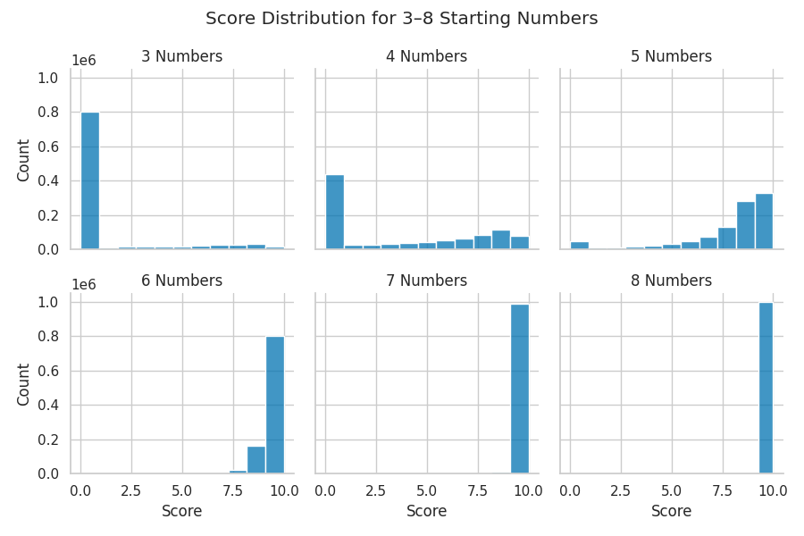
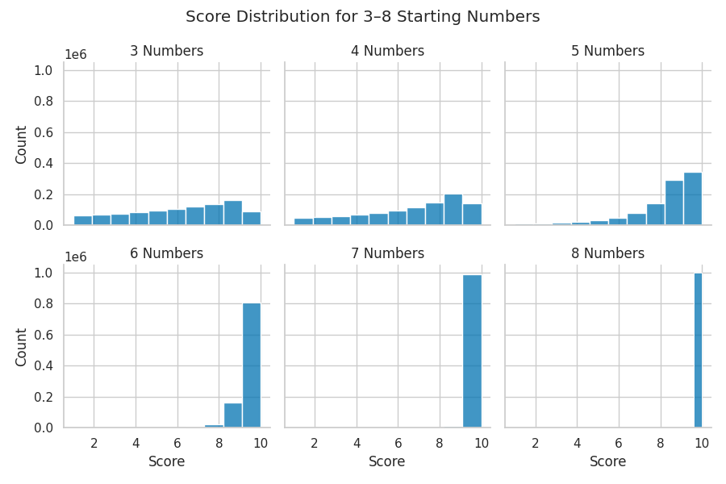
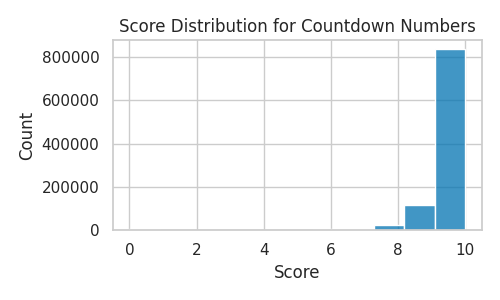
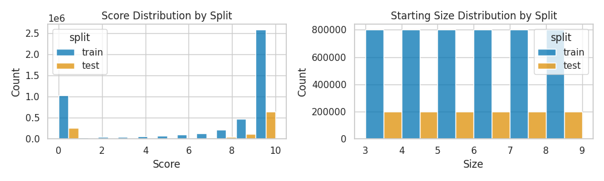
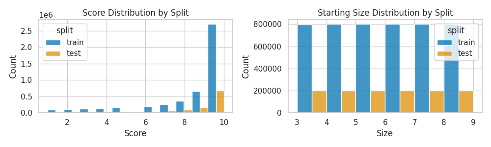
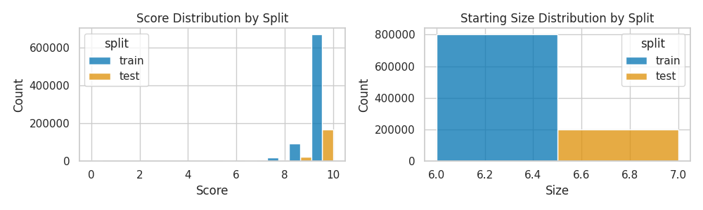

# Countdown Numbers Game Dataset

This dataset contains configurations and solutions for variations of the Countdown numbers game. Each example comprises a sequence of numbers, a target number, the computed solution (closest value), the arithmetic expression that achieves that value, the difference between the target and the computed value, and the final Countdown score.

---

## Dataset Overview

Each data point in the dataset includes:

- **Numbers:**  
  A sequence of $n$ integers $s_1, s_2, \ldots, s_n$ where $s_i \in \{1, 2, \ldots, 100\}$ for all $i \in \{1, 2, \ldots, n\}$, and $n \in \{3, 4, \ldots, 8\}$.
  (Note: In the traditional Countdown game, the numbers are subject to more specific restrictions.)

- **Target:**  
  An integer $t \in \{1, 2, \ldots, 999\}$. (For context, the standard Countdown game usually features targets from 101 and above.)

- **Closest:**  
  The value computed by a solver $r \in \{1, 2, \ldots, 999\}$ that is closest to the target number.

- **Expression:**  
  The arithmetic expression used to compute the closest value.
  For instance, $((2 + 48) \times 5) \div 10$

- **Delta:**  
  The absolute difference between the target and the closest value, i.e. $|t - r|$.

- **Score:**  
  The Countdown score calculated as $\max(0, 10 - |t - r|)$.
  This score reflects how close the computed value is to the target.

---

## Dataset Variants

This dataset is provided in three variants:

1. **Random:**  
 Configurations and solutions generated by uniformly sampling and solving one million game instances, without additional restrictions.

1. **Random Solvable (Score > 0):**  
 Configurations are generated by uniformly sampling numbers and then **rejecting** any sample that results in an unsolvable instance (i.e., a score of 0). This variant ensures that each instance has a solution that yields a positive score.

1. **Countdown:**  
 Configurations generated by sampling **6 numbers** in the style of the British TV show *Countdown*.


### HuggingFace Download Links

<div align="center">


| **Dataset Variant** | **Dataset Name**           | **Download**                                                                   |
| ------------------- | -------------------------- | ------------------------------------------------------------------------------ |
| Random              | `countdown-numbers-3-8`    | [🤗 HuggingFace](https://huggingface.co/alexjackson17/countdown-numbers-3-8)    |
| Random Solvable     | `countdown-numbers-3-8-nz` | [🤗 HuggingFace](https://huggingface.co/alexjackson17/countdown-numbers-3-8-nz) |
| Coundown Game Rules | `countdown-numbers-6-gr`   | [🤗 HuggingFace](https://huggingface.co/alexjackson17/countdown-numbers-6-gr)   |


</div>


### Score Distributions

The following histograms show the distribution of scores for each dataset variant:

#### Random Variant

<div align="center">



</div>


#### Random Solvable (Score > 0) Variant

<div align="center">



</div>

#### Countdown Game Rules

<div align="center">



</div>

---

## Generation Process

The dataset was created by:
- Uniformly sampling numbers within the specified ranges.
- Solving each sampled instance to determine the closest value, the corresponding expression, the difference from the target, and the score.
- For the **Random Solvable (Score > 0)** variant, rejection sampling was applied: instances that did not yield a positive score were discarded.

The train and test splits were created by randomly partitioning the instances into 80% training and 20% testing, using a stratified split based on the score and number of starting values.


### Split Score/Size Distributions

The final distributions of scores and numbers are shown in the following histograms:

#### Random Variant

<div align="center">



</div>

#### Random Solvable (Score > 0) Variant

<div align="center">



</div>

#### Countdown Game Rules

<div align="center">



</div>

---

## How to Use the Dataset

You can load and use this dataset with the Hugging Face `datasets` library. For example:

```python
from datasets import load_dataset

dataset = load_dataset("alexjackson17/countdown-numbers-6-gr")

# Example: Access the first entry in the training split
example = dataset["train"][0]
print("Numbers: ", example["starting"])
print("Target: ", example["target"])
print("Closest: ", example["closest"])
print("Expression: ", example["expression"])
print("Difference: ", example["delta"])
print("Score: ", example["score"])
```

---

## Citation

If you use this dataset in your research or projects, please cite it as follows:

```bibtex
@misc{jackson2025countdown,
  title = {Countdown Numbers Game Dataset},
  author = {Alex Jackson},
  year = {2025},
  note = {Released under the MIT License},
}
```

---

## Funding Attribution

This work was supported by UK Research and Innovation [grant number EP/S023356/1], in the UKRI Centre for Doctoral Training in Safe and Trusted Artificial Intelligence ([www.safeandtrustedai.org](https://www.safeandtrustedai.org)).

---

## License

This dataset is released under the MIT License. See the [LICENSE](LICENSE) file for more information.

For questions, feedback, or further information, please contact [Alex Jackson](mailto:mail@alexjackson.uk).


